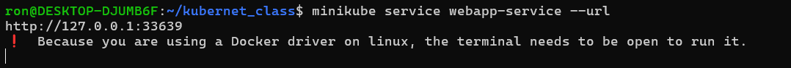
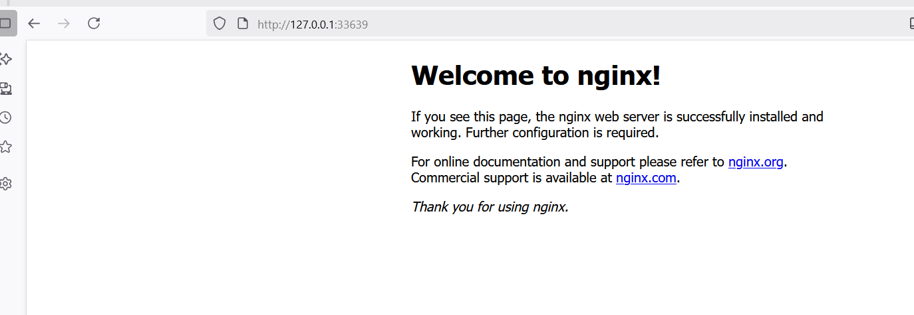

# Tarea 6 - Deployment y Service en Kubernetes

- **Curso:** Docker & Kubernetes - Clase 6
- **Estudiante:** Ronald Choque Fuentes


**Opción 1: Nginx (Más Simple)**

- Imagen: `nginx:alpine`
- Puedes usar HTML personalizado (opcional)

## Parte 2: Requisitos del Deployment
[Deployment](deployment.yaml)
```bash
kubectl apply -f deployment.yaml

```
## Parte 3: Requisitos del Service
[Service](service.yaml)
```bash
kubectl apply -f service.yaml

```
## Parte 5: Desplegar y Probar
```bash
minikube service webapp-service --url

```

